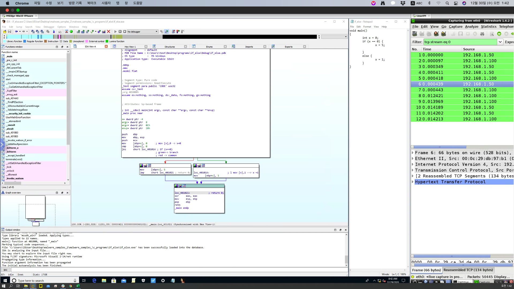
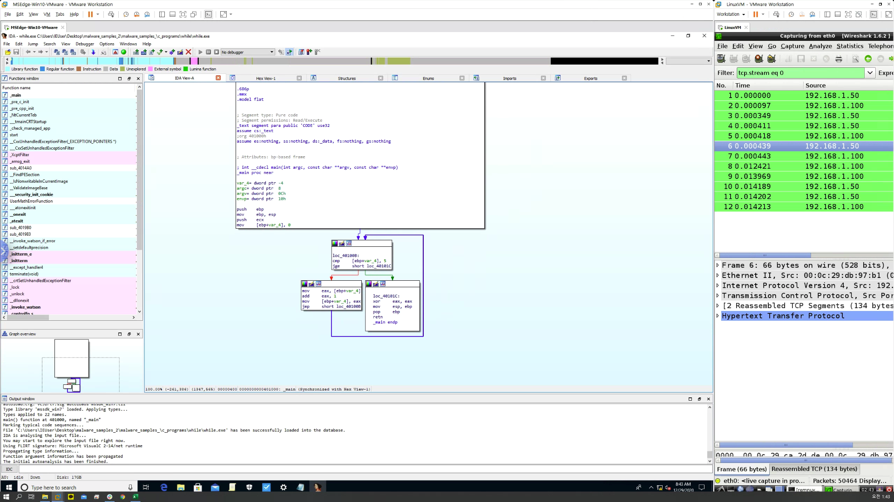

# BlackHat_2020'

## Static Analysis

* pestudio 사용을 통해서 특정파일의 Hash값부터 모든 값들을 파악할 수 있다. 
* web의 viroustotal이라는 사이트가 있는데 기존에 데이터베이스에 있는 해시값들과 비교를 하여 특정 파일의 해쉬 값이 악성코드인지 아닌지를 확인할 수 있다.
* 하지만 이떄 착안점은 공격자도 이 웹사이트를 통해 공격자가 만든 공격이 Sampling에 걸리는지 걸리지 않는지를 확인할 수 있음으로 악용될 가능성도 있다.

### File Obfuscation
* 질문
  * 탐지 분석을 어렵게 하기 위해서 난독화를 시킨다.
  * 공격자가 c또는 c로 프로그램을 작성하고 컴파일러를 통해 전달된다.
  * 흩어져 있는 메모리는 의미가 없음
  * 원본 메모리를 사용하면 <>
* 정적에서 샘플을 식별 할 수 있다면 분석관점에서 의심스러운 것이라고 말할 수 있는 난독화 프로그램에서 우리는 어떻게 샘플들을 식별할 수 있을까?
  * exeinfope 라는 window 프로그램이 있다.
  
### Pattern Matching Using YARA
* 분석할 코드들이 많은 이진과 스트링으로 되어있기 떄문에, 바이너리에서 시그니쳐를 파악할 수 있어야한다.
* 이때 malware의 샘플 분류를 해주는 것이 yara open source utility이다.
* 찾을 수 있는 새로운 바이너리를 스캔하는 규칙을 만들수 있다.
* 규칙을 만든 후 (메타데이터를 통해서) ,(=yara rule)
* yara는 악성코드 분석 도구이다.
* 샘플을 분석하고 지표를 결정하게되면 특정 샘프의 경우 스캔 할 yara 규칙을 만들 수 있다.
* 특정 패턴에 따른 것
* strings 릁 통해 특정 문자열을 검색한다는 규칙(rule)을 yara를 통해 만들어주게 되면, yara는 그 string이 있는 주소 값을 반환 시켜준다. 

### Fuzzy Hashing & Compariosn
* Technique to compare different items and determine percentage similarity
  * 샘플의 유사성은 암호화 해시의 유사성을 말할 가능성이 크다.
  * 암호는 암호 해시를 식별하는데 유용하다.
  * 바이너리가 조금만 달라져도 해시 값을 완전히 변경시킨다. 그렇다면 비슷한 샘플을 어떻게 구분하는가?
  * Fuzzy Hasing이 그것들을 블록에서 구분하여서 갖고 있게된다.
* Helps in determining the malwares smaples for similarities
* Helps in determining the variants of the same malware
* Helps in determining the malwares associated with the same actor group
* Tool: ssdeep
 * Block에서 바이너리를 구분할 수있게 해주는 도구이다.
 * example: 두개의 다른 해쉬값을 갖고 있는 malware들을 ssdeep을 쓰게되면 샘플간의 유사성을 확인할 수 있다.
 
 ### IDA pro demo
 * 정적 분석을 위한 도구이다.
 * 파일이 실행되는 것을 디스어셈블러를 통해 리버싱을 진행한다.
 
 * 분기문에서 자동으로 그래픽스로 분기가 나눠지는 것을 확인할 수 있다.
 * cmp 이후의 jump 분기문의 조건에 따라 맞을 경우 초록색으로, 틀릴경우 빨간색으로 이동할 수 있음을 보여준다.
 
 * while문도 if문과 동일하게 진행된다.
 * cmp 이후의 jump문이 jge 임으로 i>=5 가 맞을 경우에 초록색으로 그렇지 않을 경우에는 계속 빨간색 라인으로 이동되면서 while문이 진행됨을 확인할 수 있다.
 
